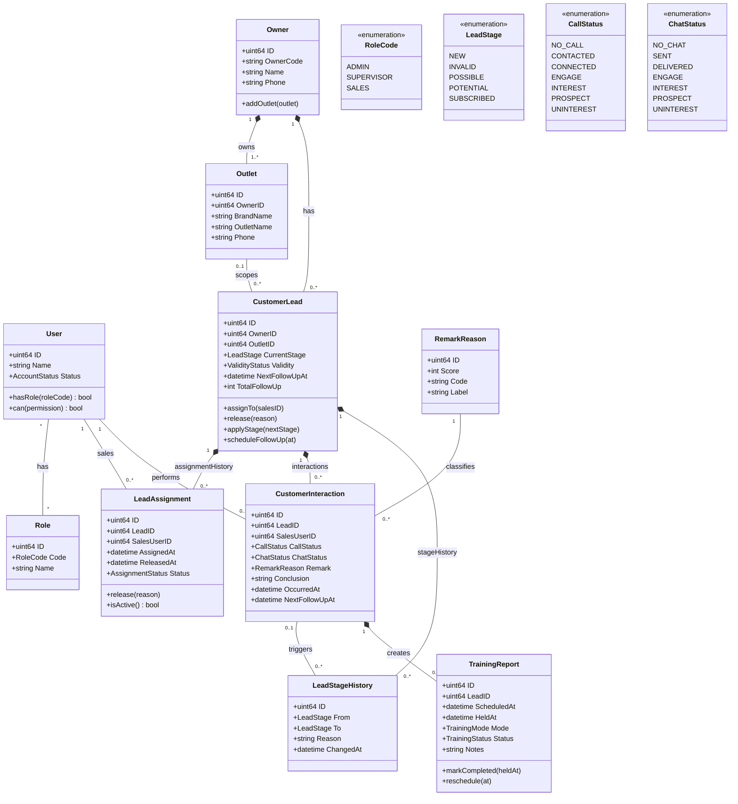
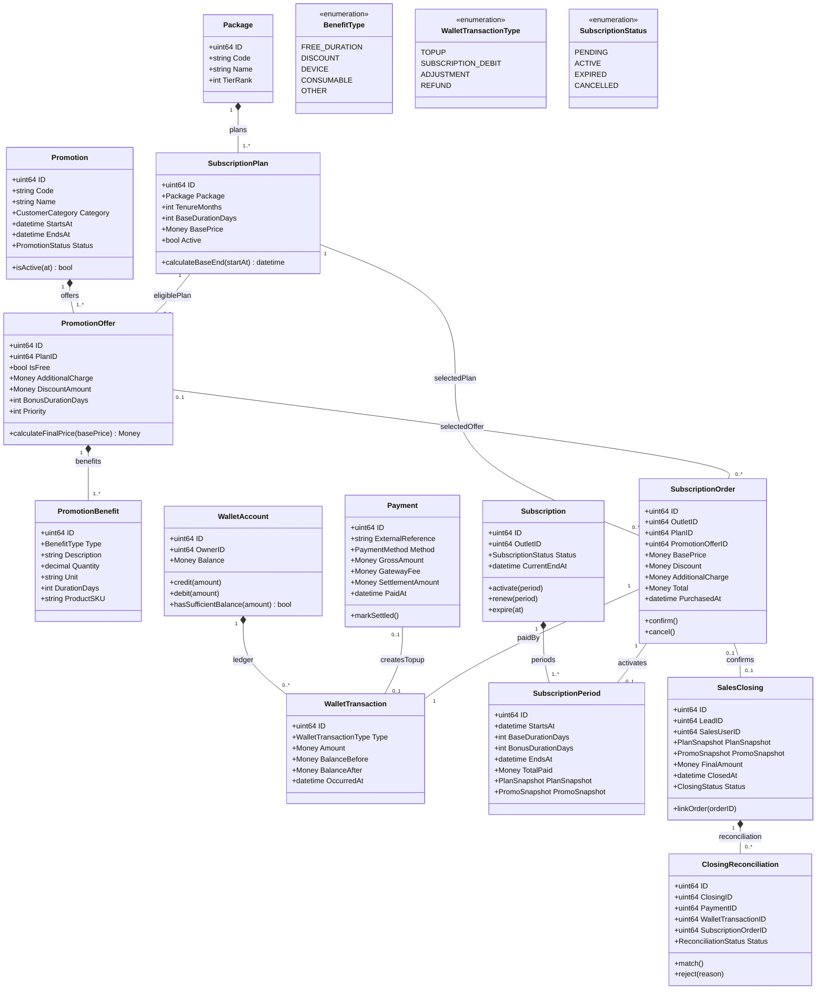
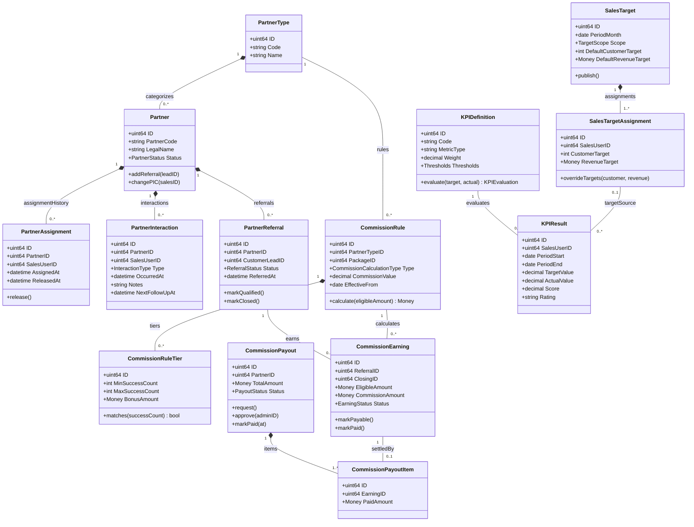

# Class Diagram CRM Piposmart

Class diagram ini menggambarkan model domain dan perilaku aplikasi target.
Diagram sengaja tidak dibuat sebagai salinan satu-banding-satu tabel database:
entity menjaga state, policy menjaga aturan bisnis, dan service mengorkestrasi
beberapa aggregate/repository.

## 1. Customer dan Sales Activity

## 2. Package, Promo, Wallet, Subscription, dan Closing

## 3. Partner, Commission, Target, dan KPI

## 4. Domain Service dan Policy

```mermaid
classDiagram
    class LeadAssignmentService {
        +assignLead(leadID, salesID, actorID)
        +releaseLead(leadID, reason, actorID)
        +redistributeLead(leadID, nextSalesID, supervisorID)
    }

    class CustomerStagePolicy {
        +resolveNextStage(currentStage, remarkScore) LeadStage
        +shouldReleasePIC(remarkScore) bool
        +canDowngrade(currentStage, nextStage) bool
    }

    class InteractionService {
        +recordInteraction(command) CustomerInteraction
        +scheduleTraining(command) TrainingReport
    }

    class PromoSelectionService {
        +findEligibleOffers(planID, category, at) PromotionOffer[]
        +prioritizeFree(offers) PromotionOffer[]
        +selectOffer(offerID) PromotionOffer
    }

    class SubscriptionDurationPolicy {
        +baseDays(tenureMonths) int
        +calculateEndDate(startAt, baseDays, bonusDays) datetime
    }

    class WalletService {
        +recordTopup(payment) WalletTransaction
        +debitForOrder(order) WalletTransaction
        +adjustBalance(command) WalletTransaction
    }

    class ClosingService {
        +recordClosing(command) SalesClosing
        +createOrderFromClosing(closingID) SubscriptionOrder
    }

    class ReconciliationService {
        +matchTopup(closingID, paymentID)
        +matchPurchase(closingID, orderID)
        +findHangingTransactions(period) ReconciliationIssue[]
    }

    class CommissionService {
        +calculateForReferral(referralID, closingID) CommissionEarning
        +createPayout(partnerID, earningIDs) CommissionPayout
        +approvePayout(payoutID, adminID)
    }

    class KPIService {
        +calculateSalesMetrics(salesID, period) SalesMetrics
        +evaluateKPI(salesID, period) KPIResult[]
        +rankSales(period) SalesRanking[]
    }

    class LeadRepository {
        <<interface>>
        +findByID(id) CustomerLead
        +save(lead)
        +findUnassigned(filter) CustomerLead[]
    }

    class WalletRepository {
        <<interface>>
        +findByOwner(ownerID) WalletAccount
        +save(account)
        +appendTransaction(transaction)
    }

    class SubscriptionRepository {
        <<interface>>
        +findActiveByOutlet(outletID) Subscription
        +save(subscription)
        +saveOrder(order)
    }

    class PartnerRepository {
        <<interface>>
        +findByID(id) Partner
        +save(partner)
        +findPayableEarnings(partnerID) CommissionEarning[]
    }

    LeadAssignmentService ..> LeadRepository
    LeadAssignmentService ..> CustomerStagePolicy
    InteractionService ..> LeadRepository
    InteractionService ..> CustomerStagePolicy
    PromoSelectionService ..> SubscriptionDurationPolicy
    WalletService ..> WalletRepository
    ClosingService ..> PromoSelectionService
    ClosingService ..> SubscriptionRepository
    ReconciliationService ..> WalletRepository
    ReconciliationService ..> SubscriptionRepository
    CommissionService ..> PartnerRepository
    KPIService ..> LeadRepository
    KPIService ..> SubscriptionRepository
```

## Invariant domain penting

- `CustomerStagePolicy` menjaga agar remark 1 tidak menurunkan customer dari
  `POTENTIAL` ke `POSSIBLE`.
- Remark 0 menghasilkan stage `INVALID` dan memicu pelepasan assignment aktif.
- `PromoSelectionService` mengurutkan promo gratis lebih dahulu; promo berbayar
  tidak boleh terpilih otomatis tanpa konfirmasi.
- `SubscriptionDurationPolicy` selalu menggunakan `tenureMonths * 30`, bukan
  penambahan bulan kalender.
- `WalletAccount` hanya berubah melalui ledger `WalletTransaction`.
- Closing tidak otomatis dianggap top-up baru. `ReconciliationService`
  menghubungkan closing dengan payment, wallet debit, dan subscription order.
- `CommissionPayout` tidak boleh dibayar tanpa item earning yang menunjukkan
  referral/customer sumber komisinya.
- KPI dihitung dari aktivitas dan closing yang sudah tersimpan, bukan angka yang
  diketik ulang oleh Sales.

