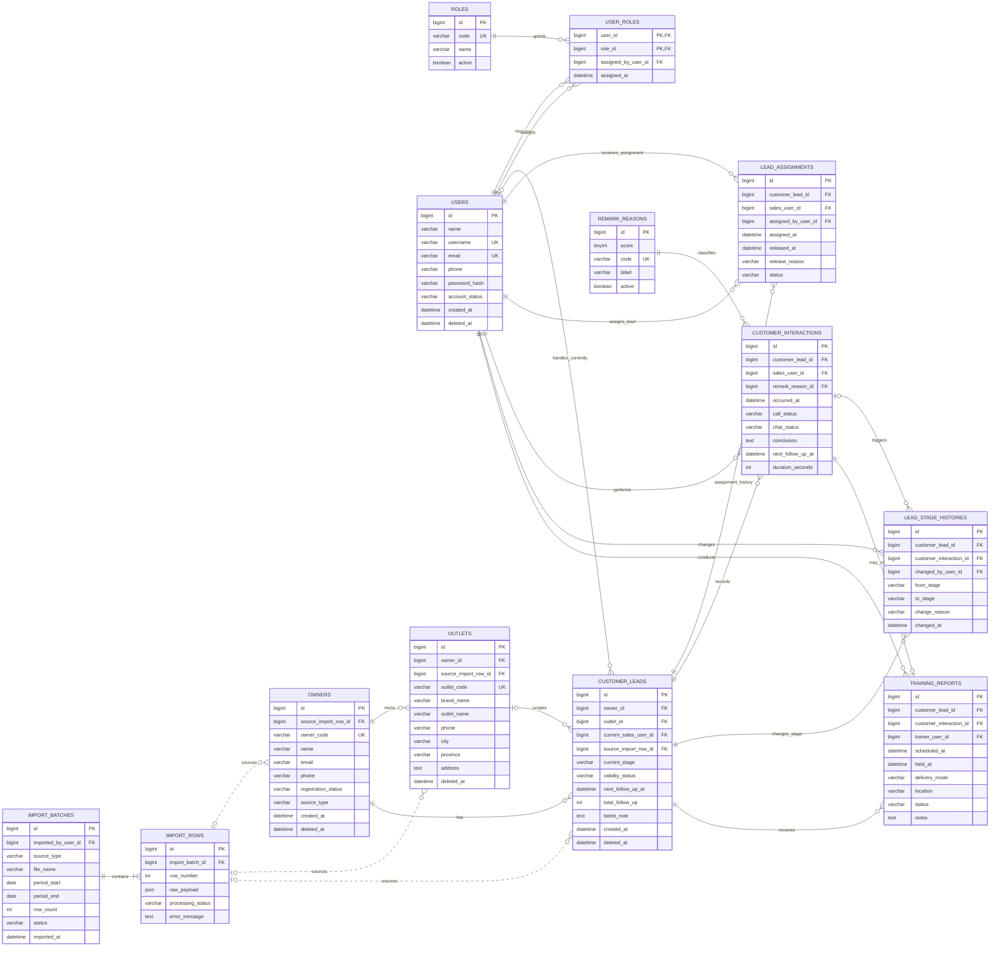
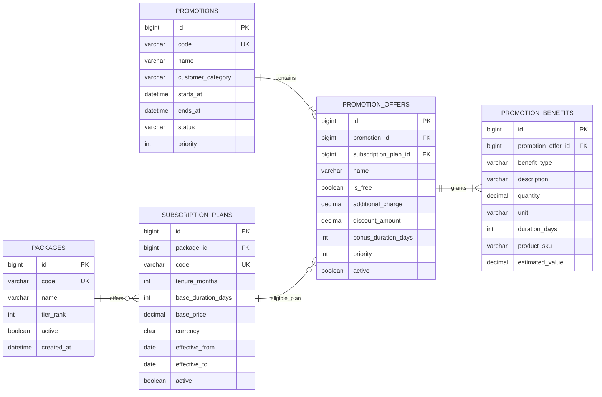
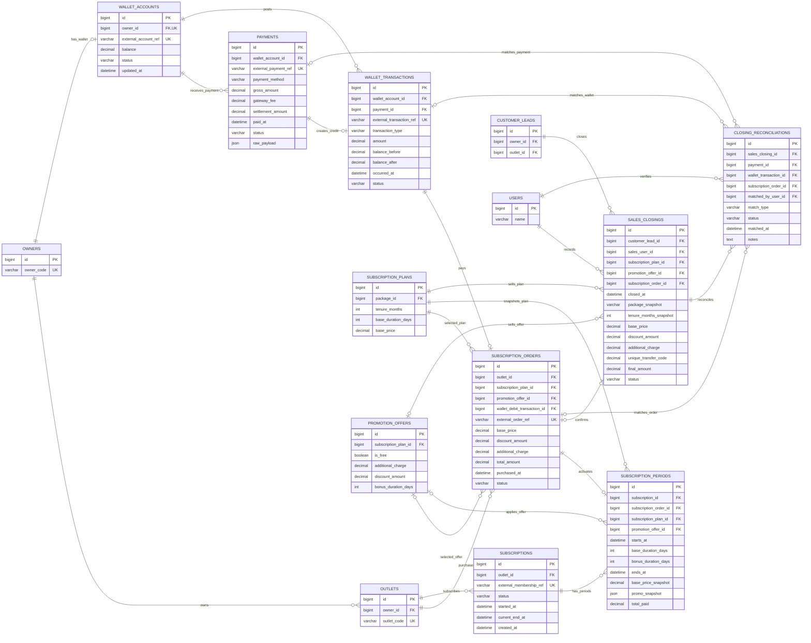
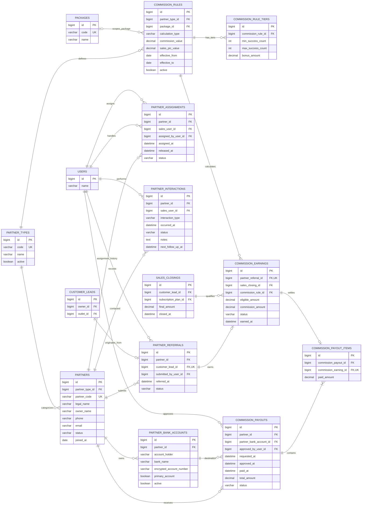
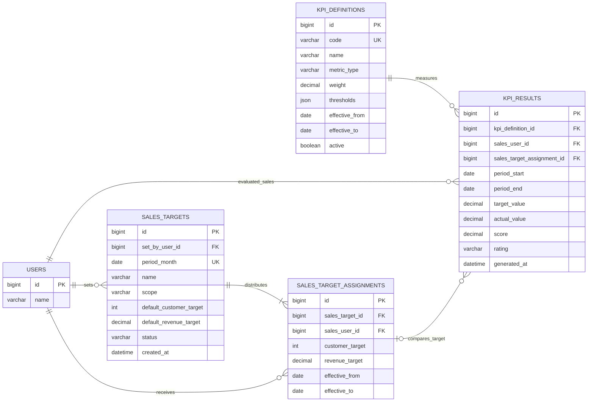

# ERD CRM Piposmart

Dokumen ini adalah rancangan target domain CRM Piposmart. Model dibagi menjadi
beberapa bounded context agar diagram tetap terbaca. Nama tabel dan kolom
menggunakan bahasa Inggris supaya konsisten dengan implementasi Go dan SQL.

## 1. Identity, Customer, dan Sales Activity

## 2. Package, Plan, dan Promotion

`PROMOTION_OFFERS` adalah pilihan promo yang dapat dipilih saat closing.
`PROMOTION_BENEFITS` menyimpan komponennya, misalnya tambahan 30 hari,
perangkat POS Android, printer thermal, atau 20 roll kertas thermal.

## 3. Wallet, Subscription, Closing, dan Reconciliation

## 4. Partner, Referral, Commission, dan Payout

## 5. Sales Target dan KPI

## Aturan dan constraint utama

1. Role resmi adalah `ADMIN`, `SUPERVISOR`, dan `SALES`. Hak akses tidak
   ditentukan dari nama user, tetapi dari `USER_ROLES`.
2. Satu owner dapat memiliki banyak outlet. Lead dan subscription dapat
   diarahkan ke outlet tertentu.
3. Hanya boleh ada satu `LEAD_ASSIGNMENTS` berstatus `ACTIVE` untuk satu lead.
   Riwayat assignment tidak ditimpa.
4. Remark adalah hasil interaksi, sedangkan `current_stage` adalah state lead.
   Remark 1 tidak boleh menurunkan stage `POTENTIAL` menjadi `POSSIBLE`.
5. Remark 0 melepaskan assignment aktif. Lead tetap dapat didistribusikan ulang.
6. Masa aktif paket menggunakan hari tetap:
   `base_duration_days = tenure_months * 30` dan
   `ends_at = starts_at + base_duration_days + bonus_duration_days`.
7. Promo gratis dipilih lebih dahulu berdasarkan `is_free` dan `priority`.
   Promo berbayar tetap merupakan pilihan eksplisit pengguna.
8. Semua nilai uang menggunakan `DECIMAL`, bukan `FLOAT`.
9. Top-up/payment adalah kejadian omzet. Closing adalah kejadian performa
   penjualan. Keduanya dipertemukan melalui reconciliation agar tidak dihitung
   ganda.
10. Harga, paket, tenor, dan promo disimpan sebagai snapshot pada closing dan
    subscription period agar laporan historis tidak berubah saat master diubah.
11. Satu commission earning berasal dari satu referral/customer yang closing.
    Payout selalu memiliki payout item sehingga sumber komisi dapat ditelusuri.
12. Dashboard dan KPI membaca source-of-truth transaksi/aktivitas. Nilai agregat
    sebaiknya berupa query/view atau snapshot terjadwal, bukan diinput manual.

